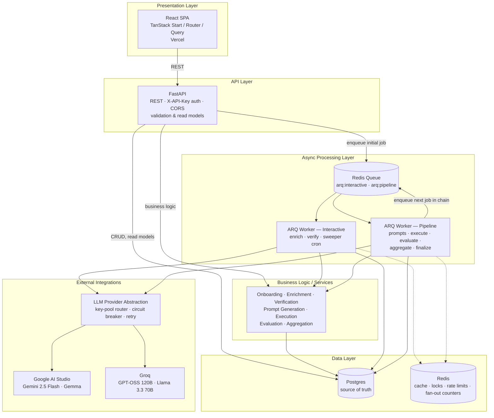
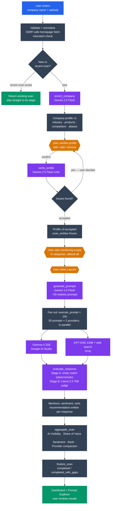

# AI Visibility Tracker

## Overview

AI Visibility Tracker monitors how AI models perceive and recommend a company. A user submits a company name and website, verifies an AI-generated company profile, and launches a scan. The platform generates ~50 realistic user prompts, queries multiple LLM providers in parallel, evaluates every response for sentiment/mentions/ranking, and presents brand visibility, sentiment, and competitor insights on a dashboard.

## Getting Started

**Prerequisites:** Docker, Python 3.13, Node 20, a Google AI Studio API key, and a Groq API key.

Onboarding (company resolution + scan creation) works with no LLM keys at all. Everything past that — enrichment, verification, prompt generation, execution, evaluation — calls Google AI Studio / Groq for real; there is no mock mode outside the test suite, so a scan will stall right after creation without real keys.

1. **Configure env vars** — one shared `.env.example`, copied into both apps
   ```bash
   cp .env.example backend/.env    # fill in the 5 GOOGLE_*/GROQ_*_KEYS with your raw API keys
   cp .env.example frontend/.env   # defaults already match the backend above
   ```

2. **Start everything**
   ```bash
   docker compose up --build
   ```
   This builds and runs Postgres, Redis, migrations, the API, both ARQ workers, and the frontend — one command, `docker-compose.yml` at the repo root.

3. Open `http://localhost:8080`, submit a company name + website, and walk through onboarding → verification → scope → launch → dashboard.

### Running natively instead (hot reload)

For active backend/frontend development, running processes directly avoids a rebuild on every save:

```bash
cd backend && docker-compose up -d              # Postgres + Redis only
cd backend && pip install -r requirements-dev.txt && alembic upgrade head
cd backend && uvicorn app.main:app --reload      # http://localhost:8000
cd backend && arq app.worker.settings.InteractiveSettings   # separate terminal
cd backend && arq app.worker.settings.PipelineSettings      # separate terminal
cd frontend && npm install && npm run dev        # http://localhost:8080
```

<!--
## Demo video

[](https://example.com/demo)
-->

## Features

- **Company onboarding** — name + website, with format validation, SSRF-safe homepage fetch, and duplicate-scan prevention
- **AI-generated company profile** — industry, products, competitors, aliases, and description, generated from the company's homepage
- **Human verification loop** — edit the AI-generated profile, then an AI critic re-checks it before anything is spent on prompts
- **Configurable monitoring scope** — choose which of 9 categories (pricing, alternatives, reviews, etc.) the scan should focus on
- **Realistic prompt generation** — ~50 prompts across informational, commercial, competitor-discovery, and product-specific categories, most of which never name the brand
- **Multi-provider execution** — every prompt run in parallel against two LLM providers, one with live web search
- **Two-stage response evaluation** — deterministic entity matching plus an LLM judge for sentiment, ranking, and recommendation
- **Brand-only mode** — when no competitors are known, the scan discovers who the models think the competitors are
- **Dashboard** — AI visibility score, recommendation rate, share of voice, sentiment breakdown, competitor leaderboard, category/provider comparison, and top cited sources
- **Prompt Explorer** — drill into any individual prompt and see both providers' raw responses and evaluations side by side
- **Resilient pipeline** — retries, per-key circuit breakers, multi-key provider pools, a daily/per-scan cost ceiling, and a self-healing sweeper that recovers stalled scans

## Architecture



## User Flow



## Tech Stack

| Layer | Technology |
|---|---|
| Backend framework | FastAPI |
| Background jobs | ARQ (two queues: interactive, pipeline) |
| Database | Postgres (Supabase), SQLAlchemy 2.0 async + asyncpg |
| Migrations | Alembic |
| Cache / queue / locks | Redis |
| Config | pydantic-settings |
| Logging | structlog |
| Fuzzy matching | rapidfuzz |
| Domain parsing | tldextract |
| HTTP client | httpx |
| Backend testing | pytest, pytest-asyncio, httpx.AsyncClient |
| Frontend framework | React 19, TanStack Start / Router / Query |
| Styling / UI | Tailwind v4, shadcn/radix |
| Charts | recharts |
| LLMs — enrichment, verification, prompt generation | Gemini 2.5 Flash (Google AI Studio) |
| LLMs — execution | Gemma (Google AI Studio), GPT-OSS 120B with web search (Groq) |
| LLMs — evaluation | Llama 3.3 70B (Groq) |
| Deployment | Render (API + workers), Vercel (frontend) |
| CI | GitHub Actions (ruff + pytest, eslint + build) |

## Challenges and Solutions

| Challenge | Problem | Solution | Impact |
|---|---|---|---|
| No "wait for all children" in ARQ | A scan fans out to ~200 execution/evaluation jobs; nothing tells you when they're all done | Redis counters as a fast-path signal, but `aggregate_scan` re-verifies completion against authoritative Postgres counts before writing metrics | Dashboards are never computed on partial data, even if a counter fires early |
| Redis is lossy | A worker crash, deploy, or Redis eviction can strand a scan mid-pipeline | A cron sweeper reconciles every stalled scan from Postgres every 2 minutes; deterministic job IDs make re-enqueuing a no-op if the job is already queued | Scans recover automatically from crashes and deploys with no manual intervention |
| Provider rate limits and dead keys | A single saturated or revoked API key can stall or truncate an entire scan | Multiple keys pooled per provider, each with its own rate limiter and circuit breaker, plus a pool-level breaker and an adaptive limiter that reads real limits off response headers | One bad key never blocks a scan; throughput scales with pool size instead of being capped by the worst key |
| One provider failing shouldn't fail the whole scan | A naive global success rate marks the whole scan `failed` even when the other provider's half is fully usable | Success rate is scored per provider; a fully unavailable provider is excluded from metrics rather than counted as failure | A scan degrades gracefully to `completed_with_gaps` instead of being thrown away |
| Prompts that name the brand trivially inflate visibility | If most prompts ask "is Acme good?", visibility reads ~100% and measures nothing | A fixed prompt-category mix (30/30/25/15) where ~85% of prompts never name the brand | The visibility score reflects genuine unprompted brand recall, not a leading question |
| Entity-matching false positives | Substring matching flags "notion" inside "notionally"; 3-letter names like "Box" match half the corpus | Word-boundary regex matching, exact-only rule for short names, fuzzy matching only as a last resort | Mention counts are accurate instead of noisy or inflated |
| Caching would defeat the point of a monitoring tool | Caching raw LLM responses would make two genuinely different scans look artificially identical | Execution responses are never cached in production; scan-level reuse (with a visible TTL) is the only intentional shortcut | Every scan reflects a real, fresh model query |
| CI failing silently on missing config | `pytest` requires `DATABASE_URL`/`REDIS_URL`/`API_KEY` with no defaults, and the workflow never set them, so every test errored out at collection | Reproduced the exact CI environment locally (no `.env`, only the workflow's own env vars) to confirm the root cause, then added the three vars to the workflow | CI passes reliably instead of failing on every push regardless of code changes |

## Best Practices and Conventions Used

| Practice | What | Why |
|---|---|---|
| Repository pattern | Every scan-scoped DB query goes through a thin repository module, never an ad hoc query | Adding multi-user support later becomes one `where` clause per repository instead of a rewrite |
| Single source of truth for state | One shared lookup table + `transition()` helper defines every legal scan-status move | Prevents every endpoint and job from hand-rolling its own status logic and drifting out of sync |
| Prompts as versioned files | Every LLM prompt lives in its own `.jinja` file, never as a Python string literal | Prompt changes show up as a clean diff — "why did visibility drop" is usually "the eval prompt changed" |
| One interface for every LLM call | A single `LLMProvider` protocol behind a fixed decorator chain (cost tracking → key-pool router → retry → timeout) | Adding or swapping a model is a config line and one adapter; nothing upstream needs to know model names |
| Idempotent writes, deterministic job IDs | Unique DB constraints plus job IDs like `exec:{prompt_id}:{provider}` | Retries, sweeper re-enqueues, and double-fires all collapse to one row, never a duplicate |
| Don't trust the signal that woke you | Aggregation re-checks completion against authoritative SQL even after its triggering counter hits zero | An early fire would silently publish a dashboard computed on half the data — worse than a slow one |
| Secrets never leave the adapter | Only a key's short ID and org are allowed into Redis, logs, or the database — never the raw secret | A leaked log line or DB row can never expose a live provider key |
| Mock the provider boundary in tests | Every phase up to the final end-to-end test runs against a mocked `LLMProvider` | Keeps the test suite free, fast, and deterministic; real API calls happen in exactly one place |
| Human gates before spending tokens | The scan pauses for profile verification and scope confirmation before any prompt is generated or executed | ~200 LLM calls are never spent validating a wrong company profile |

## Future Improvements

- Recurring/scheduled scans with trend-over-time comparison instead of one-off snapshots
- Multi-user support with real authentication (currently single-user by design)
- Multi-language prompt generation (currently English-only)
- Real-time streaming of AI responses instead of 2-second polling
- Deeper website crawling for enrichment, beyond the homepage
- One-click "add discovered competitors and re-scan" from brand-only mode
- Batched evaluation calls to reduce token load on rate-limited providers
- Reducing single-vendor dependency by moving one evaluator off Groq
