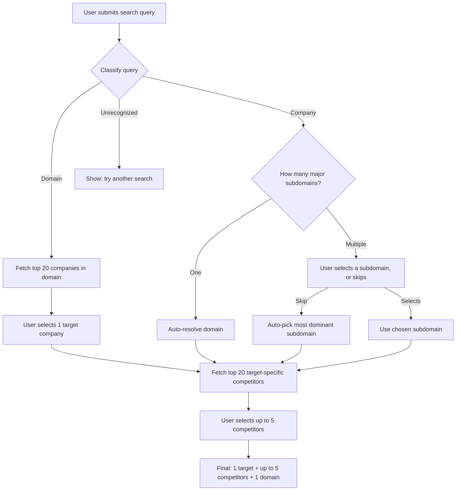

# Phase 1 — System Design

**Feature:** Company discovery & competitor selection
**Status:** Draft
**Repo:** AI-visibility-tracker (refactor)

---

## Terminology note

"Domain" and "subdomain" refer to the same underlying concept — a business vertical/category (e.g. "CRM software", "streaming services"), **not** a website URL.

- **Domain** is used when it's the top-level search input, or the single vertical finally attached to a target company.
- **Subdomain** is used specifically when listing the multiple verticals a *company* operates across, before one is chosen.

They resolve to the same taxonomy — the different word just signals which step of the flow we're in.

---

## 1. Goal

Let a user find a target company — either by searching a business vertical ("domain") or a company name directly — and end up with a curated set of up to 5 competitor companies to track against that target, scoped to one business vertical.

This replaces the current repo's single `category → brand list` discovery endpoint with a two-directional search (domain-first or company-first) that always converges on the same output: **1 target + up to 5 competitors + 1 domain.**

## 2. Scope

**In scope:**
- Query classification (domain vs. company vs. unrecognized)
- Domain → top 20 companies → target selection
- Company → major subdomains → domain resolution (manual, auto-single, or skip-to-dominant)
- Target-specific competitor pool generation (top 20)
- Competitor multi-select (max 5)
- Redis-backed caching of all generated lists
- New frontend results page, styled to match the existing Lovable landing page

**Out of scope (explicitly deferred):**
- Persisting the final selection to Postgres/Supabase — Phase 1 ends with a client-held selection object; writing it into a campaign is Phase 2.
- Any scheduled/background job (ARQ workers) — everything in Phase 1 is synchronous request/response.
- Authentication or user accounts — assumed not required for anonymous discovery; revisit if Phase 2 needs persistent ownership of campaigns.
- Fuzzy/typo correction on company names.
- Editing/undoing a selection after the target is picked (no back-navigation logic).

## 3. User Flow



**Narrative walkthrough:**

1. User types a query on the existing landing page (domain or company name) and lands on the new results page with that query.
2. Backend classifies the query as `domain`, `company`, or `not_found`.
3. **Domain path:** top 20 companies in that domain are shown; user picks one as the target. Domain is already fixed.
4. **Company path:** that company is already the target.
   - If it has exactly one major subdomain, it auto-resolves — no user action needed.
   - If it has multiple, the user picks one, or skips (in which case the system uses the single most dominant subdomain on the user's behalf).
5. **Not found**, on either path, shows a "try another search" state — no further steps possible.
6. Once target + domain are known, a fresh, target-specific competitor list (top 20) is generated.
7. User selects up to 5 competitors. This selection, plus the target and domain, is the final Phase 1 output — handed off to whatever builds the campaign next (Phase 2).

## 4. Frontend Design

**Stack:** Next.js (Vercel), pnpm. Assumes the existing landing page is (or will be ported to) the same Next.js app, so both share one design system.

**Pages:**
- Existing landing page (Lovable) — unchanged, out of scope. Captures the initial query and navigates to the results page (e.g. `/discover?q=<query>`).
- **New:** `/discover` — a single route with in-page state transitions (no new URL per step). Assumption: intermediate steps don't need to be independently bookmarkable/shareable.

**States within `/discover`:**

| State | Trigger | Shows |
|---|---|---|
| `loading_classification` | Page load | Spinner / skeleton, "Looking that up…" |
| `domain_target_select` | `type: domain_result` | Grid/list of up to 20 companies, single-select |
| `subdomain_select` | `type: company_result`, `resolution: needs_selection` | Up to 5 subdomain chips/cards, single-select + a "Skip" action |
| `loading_competitors` | After target + domain resolved | Spinner, "Finding competitors…" |
| `competitor_select` | Competitor pool returned | Up to 20 companies, multi-select capped at 5, running counter (e.g. "3 / 5 selected") |
| `not_found` | `type: not_found` | Message + CTA back to search |
| `summary` | User confirms competitor selection | Read-only recap: target, domain, selected competitors; hand-off CTA calls Phase 2's `POST /api/v1/campaigns` directly — competitors are already in the `{ "name": string }[]` shape that endpoint expects, so no transformation is needed |

**State management:** a single `useReducer` state machine covering the states above is sufficient — no need for a global store (Redux/Zustand) at this scope.

**Styling dependency:** this page must visually match the landing page (colors, type scale, spacing, button/card components). That requires either the Lovable project export or direct access to its Tailwind config / design tokens — **not yet available**, tracked under Dependencies (§14). Until then, build against placeholder tokens with a single `theme.ts`/CSS-variables file so re-theming later is a one-file change, not a rewrite.

## 5. Backend Design

**Stack:** FastAPI, uv, structlog, Sentry. No Alembic changes in Phase 1 (no new tables). Redis Cloud used directly as a cache — ARQ is not invoked anywhere in this phase.

**LLM access:** one OpenRouter API key, model selected via a config string (swappable without code changes), with OpenRouter's web search plugin attached to every discovery-related call. Grounding these calls in live web results is what makes the `not_found` / hallucination-risk story tolerable — the model isn't purely relying on parametric memory to decide whether a company or vertical is real. Trade-off: web-search-augmented calls are slower and costlier per call, which is the main reason caching (§8) matters more here than it would for a plain completion.

**Two endpoints, both stateless** — no server-side session. All context (query, chosen target, chosen domain) is passed explicitly on each call; the frontend carries state between calls.

1. `POST /api/v1/discovery/search` — classification + first list (domain company list, or company subdomain list)
2. `POST /api/v1/discovery/competitors` — target-specific competitor pool

Client-side selections (picking a target from a list, picking/skipping a subdomain, picking up to 5 competitors) never require a backend round-trip by themselves — they only feed into the next call's request body.

## 6. API Contracts

### `POST /api/v1/discovery/search`

**Request**
```json
{ "query": "HubSpot" }
```

**Response — domain path**
```json
{
  "type": "domain_result",
  "domain": "CRM software",
  "companies": [
    { "name": "Salesforce" },
    { "name": "HubSpot" }
  ]
}
```
`companies` capped at 20.

**Response — company path, single subdomain (auto-resolved)**
```json
{
  "type": "company_result",
  "company": "Zoom",
  "resolution": "auto",
  "domain": "Video conferencing"
}
```

**Response — company path, multiple subdomains**
```json
{
  "type": "company_result",
  "company": "Amazon",
  "resolution": "needs_selection",
  "subdomains": [
    { "name": "E-commerce", "is_most_dominant": true },
    { "name": "Cloud computing", "is_most_dominant": false },
    { "name": "Streaming & entertainment", "is_most_dominant": false }
  ]
}
```
`subdomains` capped at ~5. Exactly one entry has `is_most_dominant: true` — this is what the frontend uses locally if the user clicks "skip," with no extra backend call.

**Response — not found**
```json
{
  "type": "not_found",
  "query": "asdkfj",
  "message": "We couldn't find that. Try another search."
}
```

**Status codes:** `200` for all three outcomes above (a search "miss" is a valid business outcome, not an HTTP error). `400` for empty/oversized query. `429` rate limited. `502/503` on unrecoverable upstream LLM failure.

---

### `POST /api/v1/discovery/competitors`

**Request**
```json
{ "target": "Amazon", "domain": "E-commerce" }
```

**Response**
```json
{
  "target": "Amazon",
  "domain": "E-commerce",
  "competitors": [
    { "name": "Walmart" },
    { "name": "eBay" }
  ]
}
```
`competitors` capped at 20, and the target itself is always excluded from its own list. Same status code rules as above; `not_found`-style response isn't expected here since `target`/`domain` only ever arrive from a prior `search` call.

## 7. Backend Components / Services

| Module | Responsibility |
|---|---|
| `core/config.py` | Pydantic-settings config (env vars, §11) |
| `core/logging.py` | structlog setup, request-scoped logging context |
| `core/sentry.py` | Sentry init |
| `core/rate_limit.py` | Per-IP rate limiting (Redis-backed) |
| `api/v1/discovery.py` | Route handlers for `/search` and `/competitors`; request validation, calls services, maps to response schema |
| `services/openrouter_client.py` | Single wrapper around OpenRouter's `/v1/chat/completions`; injects API key, model string, web search plugin; timeout + one retry on transient failure |
| `services/cache_service.py` | Redis get/set with normalized key building (`lower().strip()`) and TTL from config |
| `services/classification_service.py` | Builds the classify prompt, calls `openrouter_client`, validates JSON against the internal schema, determines `domain_result` / `company_result` (`auto` vs `needs_selection`) / `not_found` |
| `services/company_list_service.py` | "Top 20 companies in domain X" — used for the domain path |
| `services/competitor_service.py` | "Top 20 competitors of target Y in domain X" — used after target+domain are resolved |
| `prompts/classify_query.py` | Prompt template + few-shot examples (incl. the Amazon multi-subdomain case) for classification |
| `prompts/companies_in_domain.py` | Prompt template for the generic domain company list |
| `prompts/target_competitors.py` | Prompt template for the target-specific competitor list |
| `schemas/discovery.py` | Pydantic request/response models (§6) and internal LLM-output models (§8) |

## 8. Data Models / Schema

No Postgres tables are introduced in Phase 1. Two kinds of structure matter here: the internal service-layer models (what the LLM must return, validated before being reshaped into the API response) and the Redis cache value shapes.

**Internal LLM output — classification call**
```json
{
  "recognized": true,
  "input_type": "company",
  "canonical_name": "Amazon",
  "subdomains": [
    { "name": "E-commerce", "tier": "major" },
    { "name": "Cloud computing", "tier": "major" },
    { "name": "Consumer devices", "tier": "minor" }
  ]
}
```
- `recognized: false` → maps directly to `not_found`.
- Only `tier: "major"` entries are surfaced to the user; the service layer picks the highest-ranked major entry as `is_most_dominant`.
- `input_type: "domain"` responses carry a `domain_name` field instead of `subdomains`.

**Internal LLM output — company/competitor list calls**
```json
{ "companies": ["Salesforce", "HubSpot", "Zoho CRM"] }
```
Deliberately minimal — name-only. Validated against a max length of 20 before caching.

**Redis cache entries**

| Key pattern | Value | TTL |
|---|---|---|
| `discovery:classify:{normalized_query}` | classification JSON (above) | `CACHE_TTL_SECONDS` (default 24h) |
| `discovery:domain:{normalized_domain}` | `{ "companies": [...] }` | `CACHE_TTL_SECONDS` |
| `discovery:competitors:{normalized_target}:{normalized_domain}` | `{ "competitors": [...] }` | `CACHE_TTL_SECONDS` |

Known trade-off (accepted for Phase 1, per earlier discussion): without a canonical Postgres taxonomy, near-duplicate domain names ("CRM software" vs. "CRM tools") produce separate cache entries and can drift slightly over time. Acceptable for MVP; first thing to revisit if consistency becomes a problem.

## 9. Queue / Event Models

None in Phase 1. Every operation is a synchronous HTTP request the user is actively waiting on, so ARQ (background jobs) and Redis pub/sub (events) aren't invoked here — they're reserved for Phase 2, which runs the full multi-model analysis pipeline as an on-demand background job. True scheduled/recurring refresh (running that pipeline on a cadence without a user triggering it) is further out still and isn't part of Phase 2 either. Flagging this explicitly so ARQ workers aren't set up prematurely for a phase that doesn't use them.

## 10. Error Handling

| Condition | Handling |
|---|---|
| Empty/oversized query | `400`, validation error body |
| Rate limit exceeded | `429` with `Retry-After` header |
| OpenRouter timeout/5xx | One server-side retry; if it still fails, `503` with a generic "try again shortly" message |
| OpenRouter web search plugin fails specifically | Retry once without the plugin (plain completion) rather than failing outright; log that the fallback was used |
| Malformed/invalid JSON from LLM | Pydantic validation catch → one retry with a stricter "return only valid JSON" instruction → if still invalid, treat as `not_found` and log the raw output for prompt-quality review |
| Redis unreachable | Fail **open** — skip the cache, proceed straight to the LLM call, log a warning. Never block the user on a cache outage |
| `recognized: false` from classifier | `200` with `type: not_found` — this is a normal business outcome, not a server error |
| >5 competitors selected | Enforced client-side in Phase 1; also enforced server-side by Phase 2's `POST /api/v1/campaigns` (see phase2.md §10) once the selection is actually persisted |

## 11. Configuration

Environment variables (via `pydantic-settings`):

```
OPENROUTER_API_KEY=
OPENROUTER_MODEL=              # default model string, swappable without a deploy
OPENROUTER_WEB_SEARCH_ENABLED=true
OPENROUTER_TIMEOUT_SECONDS=20

REDIS_URL=
CACHE_TTL_SECONDS=86400

MAX_COMPANIES_RETURNED=20
MAX_SUBDOMAINS_RETURNED=5
MAX_COMPETITORS=5              # shared with Phase 2 — single source of truth for the 5-competitor cap

RATE_LIMIT_PER_MINUTE=10

SENTRY_DSN=
LOG_LEVEL=info

CORS_ALLOWED_ORIGINS=          # Vercel frontend URL(s)
ENVIRONMENT=development
```

## 12. Implementation Order

1. Config/settings, structlog, Sentry init
2. `openrouter_client` wrapper (single key, model string, web search plugin) + smoke test against a real call
3. `cache_service` (Redis get/set, key normalization)
4. Pydantic schemas — request/response (§6) and internal LLM-output models (§8)
5. Prompt templates (classify, domain company list, target competitors) with golden-fixture examples
6. Service layer: `classification_service`, `company_list_service`, `competitor_service`
7. Routes: `/discovery/search`, `/discovery/competitors`
8. Rate limiting middleware
9. Error handling / exception handlers
10. Unit + integration tests (backend)
11. Frontend: extract/confirm design tokens from the Lovable landing page
12. Frontend: build `/discover` states and the `useReducer` state machine
13. Frontend: wire to backend endpoints
14. Manual QA pass against curated real-world queries (see §15)
15. Deploy — Render (backend), Vercel (frontend); wire Sentry + Better Stack/Axiom log drains

## 13. Acceptance Criteria / Final Contract

- A recognized domain query returns at most 20 companies, no more.
- A recognized single-subdomain company auto-resolves with zero required user input.
- A recognized multi-subdomain company returns subdomains with exactly one `is_most_dominant: true`.
- Skipping subdomain selection produces the same domain as the `is_most_dominant`-flagged one, without a second backend call.
- The competitor pool is always target-specific (not a generic domain list), capped at 20, and never includes the target itself.
- The frontend prevents selecting more than 5 competitors (also enforced server-side once a campaign is created — see phase2.md §10).
- Any unrecognized domain or company query returns `type: not_found` with HTTP `200`, never a `404`.
- Identical queries within the cache TTL don't trigger a new OpenRouter call (verifiable via logs).
- Rate-limited requests return `429` with `Retry-After`.
- Nothing from this phase is written to Postgres/Supabase.

## 14. Dependencies

- OpenRouter account with a single API key, billing configured, and web search plugin availability confirmed for the chosen model.
- Redis Cloud instance provisioned; connection string available to the backend.
- **Blocking for pixel-accurate frontend work:** access to the Lovable landing page's source/export (or at minimum its Tailwind config / design tokens) to mirror styling exactly.
- **Open item:** confirm whether the Lovable landing page is already Next.js, or a Vite/React scaffold that needs porting into the Next.js app before the two pages can share a design system cleanly.
- Sentry project + DSN for both backend and frontend.
- Better Stack/Axiom account with a log drain configured for the Render service.
- Vercel project linked to the frontend repo; Render web service provisioned for the backend.

## 15. Testing Strategy

- **Unit tests** (pytest + pytest-asyncio): service layer with `openrouter_client` mocked — prompt construction, response parsing, retry/fallback paths, cache read/write calls.
- **Contract tests:** golden fixture files for known cases (Amazon/Google-style multi-subdomain companies, HubSpot/Zoom-style single-subdomain companies, "CRM software"-style valid domains, nonsense input) — Pydantic validation against real prompt output, run in CI to catch prompt regressions before they ship.
- **Integration tests:** FastAPI `TestClient` against `/discovery/search` and `/discovery/competitors` with Redis + OpenRouter mocked, covering all four response types (`domain_result`, `company_result` auto, `company_result` needs-selection, `not_found`).
- **Manual/exploratory QA:** a curated list (~15–20 queries) run against the real OpenRouter call before each deploy — well-known single-domain company, well-known multi-domain company, obscure/fabricated company name, valid niche domain, nonsense domain.
- **Rate limit test:** burst requests to confirm `429` + `Retry-After` behavior.
- **Frontend:** component tests per `/discover` state (React Testing Library) + one Playwright/Cypress end-to-end happy-path test covering search → target/subdomain resolution → competitor selection → summary.

## 16. Project Structure / Folder Structure

```
backend/
  app/
    main.py
    core/
      config.py
      logging.py
      sentry.py
      rate_limit.py
    api/
      v1/
        discovery.py
    services/
      openrouter_client.py
      cache_service.py
      classification_service.py
      company_list_service.py
      competitor_service.py
    prompts/
      classify_query.py
      companies_in_domain.py
      target_competitors.py
    schemas/
      discovery.py
  tests/
    unit/
    integration/
    fixtures/
  pyproject.toml          # uv
  alembic/                # untouched in Phase 1

frontend/
  app/
    discover/
      page.tsx
      components/
        LoadingState.tsx
        DomainTargetSelect.tsx
        SubdomainSelect.tsx
        CompetitorPool.tsx
        NotFoundState.tsx
        SummaryState.tsx
      state/
        discoverReducer.ts
    lib/
      api/
        discovery.ts       # fetch wrapper for the two backend endpoints
      theme/
        tokens.ts           # placeholder until Lovable tokens are extracted
  package.json              # pnpm
```
