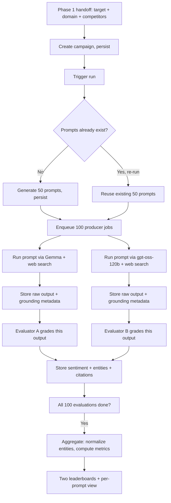

# Phase 2 — System Design

**Feature:** Prompt generation, multi-model execution, evaluation & visibility leaderboard
**Status:** Draft
**Depends on:** Phase 1 (target company + domain + up to 5 competitors)

---

## Terminology note

- **Campaign** — the persistent record of a target company, its domain, and its tracked competitors (the Phase 1 output, now written to Postgres). A campaign's 50 prompts are generated once and belong to it.
- **Run** — one execution of a campaign's prompt set. Re-running a campaign creates a new run against the *same* 50 prompts, so results are comparable over time. Phase 2 builds the data model to support this; the trend/comparison UI itself is future work.
- **Producer model** — one of the two models that actually answers a prompt (Gemma, gpt-oss-120b), both web-search enabled.
- **Evaluator model** — one of the two models that grades a producer model's output for sentiment, mentions, and citations. Strictly paired: Evaluator A only ever grades Gemma's outputs, Evaluator B only ever grades gpt-oss's.

---

## 1. Goal

Take a campaign's target + domain + competitors, generate 50 domain-relevant research prompts, run each through two AI models with web search, evaluate every response for target-company sentiment and company mentions/citations, and surface two per-model leaderboards showing how visible and how cited the target and its competitors are in AI-generated answers.

## 2. Scope

**In scope:**
- Prompt generation (50 prompts per campaign, persisted, reused across future runs)
- Execution against 2 producer models (Gemma, gpt-oss-120b), both web-search enabled, 100 raw outputs per run
- Evaluation via 2 paired evaluator models, one call per output (100 evaluation calls per run)
- Metric aggregation: mentions, AI visibility, citations, citation share, share of voice, sentiment breakdown
- Two separate per-model leaderboards + a per-prompt sentiment/mention view
- Background job orchestration (ARQ) with bounded concurrency and pollable progress
- Full persistence in Supabase: campaigns, prompts, runs, raw results, evaluations, aggregated leaderboard rows

**Out of scope (explicitly deferred):**
- A combined/blended cross-model leaderboard (nice-to-have, later)
- A deterministic domain registry for citation matching — this phase relies entirely on LLM-inferred entity/citation mapping, by design
- Trend/comparison UI across multiple runs (data model supports it; visualization doesn't exist yet)
- Editing or regenerating individual prompts after generation
- Re-running a subset of prompts/models — a run is all-or-nothing (100 producer + 100 evaluator calls)
- User-selectable models per campaign — producer/evaluator models are fixed via config, not chosen per campaign
- Scheduled/recurring runs — this phase is triggered on-demand by the user only. Phase 1's original framing of eventually refreshing data "on a cadence" is still further-out future work, not delivered here

## 3. User Flow



The producer → evaluator pairing (H→J→L and I→K→M) happens independently for each of the 50 prompts; the diagram collapses that repetition for readability.

**Narrative walkthrough:**

1. A campaign is created from the Phase 1 selection (target, domain, up to 5 competitors) and persisted.
2. User triggers a run. If prompts don't exist yet for this campaign, they're generated (1 web-search-grounded LLM call → 50 prompts, persisted). If this is a re-run, the existing 50 are reused.
3. 100 producer jobs are enqueued (50 prompts × 2 models), bounded by worker concurrency.
4. As each producer call completes, its matching evaluator job is enqueued automatically (Gemma output → Evaluator A, gpt-oss output → Evaluator B).
5. Once all 100 evaluations for the run are done, aggregation runs: entity names are normalized across the (isolated) evaluation calls, and metrics are computed per company per producer model.
6. Frontend polls a status endpoint throughout; once complete, the dashboard shows the per-prompt table and the two leaderboards.

## 4. Frontend Design

**New routes**, building on the Phase 1 `/discover` flow and matching its design system:

- `/campaign/[id]/run` — trigger + progress view
- `/campaign/[id]/results` — the dashboard

**States on the run/progress page:**

| State | Shows |
|---|---|
| `ready` | "Run analysis" CTA |
| `generating_prompts` | "Generating research questions…" |
| `running` | Progress bar / counters — e.g. "62 / 100 responses collected, 40 / 100 evaluated" |
| `completed` | Redirect (or link) to results |
| `completed_with_errors` | Same as completed, plus a subtle note that some cells are unavailable |
| `failed` | Error state with retry CTA (only reachable if prompt generation itself fails — nothing downstream can run without prompts) |

**Dashboard components:**

- **Prompt table** — one row per prompt, showing prompt text, and for each producer model: a sentiment badge (positive/neutral/negative/unavailable) and a mentioned indicator. Likely a tab or toggle to switch between "Gemma view" and "gpt-oss view" rather than cramming both into one row.
- **Leaderboard** — sortable table (by AI visibility, mentions, citations, or share of voice), one per producer model, switched via tab. Each row: company name, a "Target" badge for the target company, a distinct badge for pre-selected competitors vs. newly-discovered companies, and the full metric set (§8). Sentiment breakdown shown as a small 3-segment bar (positive/neutral/negative %) per row.
- **Unavailable cells** are visually distinct from "not mentioned" (e.g. a grey dash rather than a red/neutral badge) — they mean "we couldn't get a reading," not "this company wasn't mentioned."

## 5. Backend Design

**Stack:** FastAPI (routes + status/results endpoints), ARQ worker (Render worker process, separate from the web service) for everything long-running, Redis Cloud as the ARQ broker, Supabase Postgres for all persistence, Alembic for schema migrations, structlog throughout, Sentry on both web and worker processes.

**Job orchestration (ARQ):**

1. `generate_prompts(campaign_id)` — enqueued once per run, skipped if prompts already exist for the campaign.
2. `run_producer(run_id, prompt_id, producer_model)` — 100 jobs enqueued once prompts are ready. Bounded concurrency (a fixed worker pool size, not all 100 in flight at once) to respect OpenRouter rate limits and cost.
3. `evaluate_output(result_id)` — chained: enqueued automatically the moment its matching `run_producer` job succeeds. Uses the evaluator paired to that result's producer model.
4. `aggregate_run(run_id)` — enqueued once the run's counters show all 100 evaluations have resolved (success or terminally-failed). Normalizes entities, computes leaderboard rows, marks the run `completed` or `completed_with_errors`.

**Progress tracking:** lives in Postgres (the `campaign_runs` row), not a separate cache — single source of truth, updated as each job resolves. Redis here is purely the ARQ broker; no separate pub/sub layer needed for this phase. The frontend polls `GET /api/v1/campaigns/{campaign_id}/runs/{run_id}/status` (§6), which just reads that row.

**Reused from Phase 1, not duplicated:** `core/config.py`, `core/logging.py`, `core/sentry.py`, and `core/rate_limit.py` are extended in place — new env vars, worker-process Sentry wiring, and the run-trigger cooldown (§10) all live in the same modules Phase 1 already established, plus a new `main.py` entrypoint reference for the worker process.

## 6. API Contracts

### `POST /api/v1/campaigns`
Persists the Phase 1 selection.

**Request**
```json
{
  "target": "HubSpot",
  "domain": "CRM software",
  "competitors": [
    { "name": "Salesforce" },
    { "name": "Zoho CRM" },
    { "name": "Pipedrive" }
  ]
}
```
Matches the `{ "name": string }[]` shape phase1.md's `/discovery/competitors` already returns — the frontend passes the Phase 1 selection straight through, no reshaping required. This also matches the `campaigns.competitors` storage shape in §8, so there's no transform on the way in or out.

**Response**
```json
{ "campaign_id": "cmp_123", "status": "created" }
```

### `POST /api/v1/campaigns/{campaign_id}/run`
Triggers a new run (generates prompts if this is the first run).

**Response**
```json
{ "campaign_id": "cmp_123", "run_id": "run_456", "status": "queued" }
```

### `GET /api/v1/campaigns/{campaign_id}/runs/{run_id}/status`
**Response**
```json
{
  "run_id": "run_456",
  "status": "running",
  "progress": {
    "prompts_generated": true,
    "producer_calls_done": 62,
    "producer_calls_total": 100,
    "evaluator_calls_done": 40,
    "evaluator_calls_total": 100,
    "aggregation_done": false
  }
}
```
`status` ∈ `queued | generating_prompts | running | aggregating | completed | completed_with_errors | failed`

### `GET /api/v1/campaigns/{campaign_id}/runs/{run_id}/results`
Returned once `status` is `completed` or `completed_with_errors`.

```json
{
  "run_id": "run_456",
  "target": "HubSpot",
  "domain": "CRM software",
  "prompts": [
    {
      "prompt_id": "p_1",
      "text": "What's the best CRM for a 10-person sales team?",
      "gemma": { "sentiment": "positive", "mentioned": true },
      "gpt_oss": { "sentiment": "neutral", "mentioned": false }
    }
  ],
  "leaderboards": {
    "gemma": [
      {
        "company": "HubSpot",
        "is_target": true,
        "is_known_competitor": false,
        "mentions": 31,
        "ai_visibility": 62.0,
        "citations": 18,
        "citation_share": 36.0,
        "share_of_voice": 24.4,
        "sentiment": { "positive": 70.9, "neutral": 22.6, "negative": 6.5 }
      }
    ],
    "gpt_oss": [ "same shape" ]
  }
}
```
A `"sentiment": null` / `"mentioned": null` (rather than `false`) marks an unavailable cell — distinct from a genuine non-mention.

**If called before the run has completed:** returns `200` with the same shape as the status endpoint above, not an error — a run that exists but isn't finished yet is a valid business state, consistent with Phase 1's status-code philosophy (phase1.md §13: business misses are `200`, not error codes). `404` is reserved strictly for an unknown `campaign_id` or `run_id`.

## 7. Backend Components / Services

| Module | Responsibility |
|---|---|
| `api/v1/campaigns.py` | Route handlers: create, trigger run, status, results |
| `workers/tasks.py` | ARQ task functions: `generate_prompts`, `run_producer`, `evaluate_output`, `aggregate_run` |
| `workers/worker_settings.py` | ARQ `WorkerSettings` — registered functions, Redis connection, `max_jobs` (concurrency cap) |
| `services/prompt_generation_service.py` | Builds the prompt-gen call, validates output count/shape, persists 50 `Prompt` rows |
| `services/producer_service.py` | Runs one prompt against one producer model; captures response text + grounding/annotation metadata |
| `services/evaluator_service.py` | Runs one evaluation call for one raw result; extracts target sentiment + entity/citation list |
| `services/aggregation_service.py` | Normalizes entity names across a model's 50 evaluations (fuzzy-match near-duplicates); computes all leaderboard metrics; excludes unavailable cells from denominators |
| `services/openrouter_client.py` | Reused from Phase 1, extended with role-based model config (prompt-gen, 2 producer roles, 2 evaluator roles) |
| `core/rate_limit.py` (extended) | Adds the per-campaign run-trigger cooldown alongside Phase 1's existing per-IP limiter — both apply together, one doesn't replace the other |
| `core/config.py`, `core/logging.py`, `core/sentry.py` (extended) | New env vars (model roles, `DATABASE_URL`, ARQ settings) and Sentry wiring for the worker process — same modules as Phase 1, not new ones |
| `schemas/campaign.py` | Pydantic request/response models (§6) |
| `models/*.py` | SQLAlchemy models backing §8 |
| `prompts/generate_prompts.py` | Prompt-generation template |
| `prompts/evaluate_output.py` | Evaluator template — sentiment + entity/citation extraction instructions, incl. the broad "any source clearly about the company" citation rule and explicit target/competitor context |

## 8. Data Models / Schema

**`campaigns`**
| Column | Type | Notes |
|---|---|---|
| id | uuid pk | |
| target_company | text | |
| domain | text | |
| competitors | jsonb | array of `{ "name": string }`, max 5 |
| created_at | timestamptz | |

**`prompts`**
| Column | Type | Notes |
|---|---|---|
| id | uuid pk | |
| campaign_id | uuid fk | |
| text | text | |
| created_at | timestamptz | Generated once; reused by every run of this campaign |

**`campaign_runs`**
| Column | Type | Notes |
|---|---|---|
| id | uuid pk | |
| campaign_id | uuid fk | |
| status | enum | `queued/generating_prompts/running/aggregating/completed/completed_with_errors/failed` |
| producer_calls_done / total | int | progress counters |
| evaluator_calls_done / total | int | progress counters |
| started_at / completed_at | timestamptz | |

**`results`** (one row per prompt × producer model, per run)
| Column | Type | Notes |
|---|---|---|
| id | uuid pk | |
| run_id | uuid fk | |
| prompt_id | uuid fk | |
| producer_model | enum | `gemma / gpt_oss` |
| raw_text | text | |
| grounding_urls | jsonb | `[{ "url": string, "title": string }]` — fed to the evaluator as citation context |
| status | enum | `success / failed` |

**`evaluations`** (1:1 with a successful `result`)
| Column | Type | Notes |
|---|---|---|
| id | uuid pk | |
| result_id | uuid fk | |
| evaluator_model | enum | `evaluator_a / evaluator_b` |
| target_sentiment | enum | `positive / neutral / negative` |
| entities | jsonb | see below |
| status | enum | `success / failed` |

`entities` shape:
```json
[
  { "raw_name": "Salesforce.com", "canonical_name": "Salesforce", "relation": "known_competitor", "mentioned": true, "cited": false },
  { "raw_name": "Zoho CRM", "canonical_name": "Zoho CRM", "relation": "discovered", "mentioned": true, "cited": true }
]
```
`relation` ∈ `target / known_competitor / discovered`. `cited` follows the broad rule — any source clearly about that company counts, not just its own first-party domain.

**`leaderboard_entries`** (recomputed fresh per run, not incrementally maintained)
| Column | Type | Notes |
|---|---|---|
| id | uuid pk | |
| run_id | uuid fk | |
| producer_model | enum | `gemma / gpt_oss` |
| company | text | canonical name |
| is_target / is_known_competitor | bool | |
| mentions / citations | int | max 50, denominator excludes unavailable cells |
| ai_visibility / citation_share / share_of_voice | float | percentages |
| sentiment_positive_pct / neutral_pct / negative_pct | float | among prompts where this company was mentioned |

## 9. Queue / Event Models

This is the first phase where ARQ is actually used (Phase 1 was fully synchronous).

- **Broker:** Redis Cloud, used strictly as ARQ's job queue — no separate pub/sub or event bus. ARQ's default key prefix (`arq:`) doesn't collide with Phase 1's `discovery:*` cache keys, so sharing the same Redis Cloud instance is safe from a namespacing standpoint. What's still open is purely operational — whether to isolate load/blast-radius with a separate instance — not a correctness concern; either topology works.
- **Concurrency cap:** worker pool bounded (`ARQ_MAX_CONCURRENT_JOBS`, default 8) — applies across producer *and* evaluator jobs combined, since both hit OpenRouter.
- **Chaining, not polling:** an evaluator job is enqueued directly by its producer job on success, rather than a separate process polling for "new results to evaluate."
- **Completion detection:** `aggregate_run` fires once `evaluator_calls_done == evaluator_calls_total` on the `campaign_runs` row — updated via an atomic increment each time an evaluator job resolves (success or terminal failure), so the last one to finish triggers aggregation exactly once.
- **Retry policy:** each job type gets one retry on transient failure (timeout, 5xx) before being marked `failed` — failures don't block sibling jobs or the run as a whole.

## 10. Error Handling

| Condition | Handling |
|---|---|
| Producer call fails (timeout/5xx) | 1 retry → mark that `result` row `failed` → matching evaluator job is skipped, not enqueued |
| Evaluator call fails or returns malformed JSON | 1 retry (stricter "valid JSON only" instruction) → mark `evaluation` row `failed` |
| Any failed cell | Excluded from that model's mention/citation **denominators** in aggregation — a run with 2 failed Gemma calls computes Gemma's visibility against 48, not 50. Never silently treated as "not mentioned" |
| Prompt generation fails | Run marked `failed` outright — nothing downstream can proceed without prompts |
| Some producer/evaluator failures, rest succeed | Run marked `completed_with_errors`, dashboard still renders with unavailable cells marked distinctly |
| Redis/ARQ broker unreachable | `POST /run` returns `503`; existing in-flight jobs may stall — surfaced via Sentry alerting on the worker process |
| Run-trigger abuse | Rate limited per campaign (e.g. one run per campaign per N minutes) to prevent accidental repeated triggering of a ~200-call pipeline |
| Invalid campaign payload (empty `target`/`domain`, >5 `competitors`, malformed competitor entries) | `400`, validation error body — this is the server-side enforcement phase1.md §10 explicitly deferred to Phase 2 |
| High-frequency requests generally | Phase 1's existing per-IP limiter (`RATE_LIMIT_PER_MINUTE`) still applies across all endpoints, including these — the run-trigger cooldown above is an additional, narrower layer on top of it, not a replacement |

## 11. Configuration

```
OPENROUTER_API_KEY=                       # shared with Phase 1
OPENROUTER_PROMPT_GEN_MODEL=
OPENROUTER_PRODUCER_MODEL_GEMMA=          # web-search enabled
OPENROUTER_PRODUCER_MODEL_GPT_OSS=        # web-search enabled
OPENROUTER_EVALUATOR_MODEL_A=             # grades Gemma outputs
OPENROUTER_EVALUATOR_MODEL_B=             # grades gpt-oss outputs
OPENROUTER_TIMEOUT_SECONDS=30

DATABASE_URL=                              # Supabase Postgres
REDIS_URL=                                 # ARQ broker
ARQ_MAX_CONCURRENT_JOBS=8
ARQ_JOB_RETRY_LIMIT=1

PROMPTS_PER_CAMPAIGN=50
# MAX_COMPETITORS — reused from Phase 1's config (phase1.md §11), not redefined here

RUN_TRIGGER_RATE_LIMIT_MINUTES=

SENTRY_DSN=
LOG_LEVEL=info
```

## 12. Implementation Order

1. Alembic migrations: `campaigns`, `prompts`, `campaign_runs`, `results`, `evaluations`, `leaderboard_entries`
2. Extend `openrouter_client` for role-based model config (5 configurable model slots)
3. `prompt_generation_service` + template — test in isolation
4. `producer_service` — test against both Gemma and gpt-oss, confirm grounding metadata is captured correctly
5. `evaluator_service` — test against both evaluator roles, confirm entity/citation JSON shape is stable
6. ARQ worker setup: task definitions, concurrency config, producer→evaluator chaining
7. `aggregation_service` — entity normalization + metric math, unit tested against fixture data (including deliberately near-duplicate names and failed cells)
8. Campaign endpoints: create, run, status, results
9. Progress counters wired to Postgres, updated per job resolution
10. Error handling: retries, failed-cell marking, `completed_with_errors` status
11. Frontend: run-trigger + progress page
12. Frontend: dashboard (prompt table + dual leaderboard, unavailable-cell styling)
13. End-to-end smoke test on a real (small-scale) campaign before enabling for real users
14. Deploy: Render worker process, Alembic migration run, all env vars configured, Sentry wired on both processes

## 13. Acceptance Criteria / Final Contract

- A campaign persists target, domain, and up to 5 competitors.
- A campaign's first run generates exactly 50 prompts; subsequent runs reuse the same 50.
- Every run produces exactly 100 producer calls (50 × 2 models) and up to 100 evaluator calls (paired 1:1, skipped only for failed producer calls).
- Mentions and citations are counted at most once per prompt per company, per model (bounded 0–50).
- Failed cells are excluded from that model's metric denominators and rendered as visually distinct "unavailable" — never conflated with a genuine non-mention.
- Two leaderboards are produced per run, one per producer model, each including the target, all pre-selected competitors, and any newly-discovered company mentioned at least once.
- Share of voice across all companies on a given leaderboard sums to 100%.
- Progress is queryable in real time via the status endpoint for the duration of a run.
- No more than `ARQ_MAX_CONCURRENT_JOBS` OpenRouter calls are in flight at once.
- Nothing in this phase depends on a static company-domain registry — all entity/citation mapping is LLM-inferred, by design.

## 14. Dependencies

- Everything from Phase 1 (OpenRouter key, Redis Cloud).
- Confirmed OpenRouter model identifiers, with web search plugin support, for: prompt generation, Gemma (producer), gpt-oss-120b (producer), Evaluator A, Evaluator B.
- Supabase Postgres provisioned; Alembic wired into the deploy pipeline (first real migrations of the project).
- Render worker process provisioned separately from the existing web service, to run the ARQ worker.
- Decision needed before deploy: shared vs. separate Redis Cloud instance for Phase 1's cache and Phase 2's ARQ broker.

## 15. Testing Strategy

- **Unit tests** per service (`prompt_generation_service`, `producer_service`, `evaluator_service`, `aggregation_service`), OpenRouter fully mocked.
- **Aggregation fixture tests** — a known, hand-crafted set of 50 fake evaluations (including near-duplicate entity names and a few failed cells) to assert: normalization merges duplicates correctly, denominators exclude failures, percentages never exceed 100%, and share of voice sums to 100%.
- **Integration test** — a scaled-down full pipeline (e.g. 5 prompts instead of 50) run against mocked OpenRouter, verifying every persisted row (`results`, `evaluations`, `leaderboard_entries`) matches expectations end to end.
- **Contract/golden tests** — a small number of real OpenRouter calls (run manually or in a nightly job, not every CI run) to catch prompt or schema drift in the grounding metadata and evaluator output.
- **Concurrency test** — a mocked producer with artificial delay, asserting no more than `ARQ_MAX_CONCURRENT_JOBS` calls are ever in flight simultaneously.
- **Frontend** — progress-polling component tests, dashboard rendering tests against fixture data (including the unavailable-cell state), one end-to-end test covering trigger → progress → dashboard against a mocked backend.

## 16. Project Structure / Folder Structure

```
backend/
  app/
    main.py                  # unchanged from Phase 1; also referenced by the worker entrypoint
    core/
      config.py               # extended: new env vars (§11)
      logging.py
      sentry.py                # extended: wired for the worker process too
      rate_limit.py             # extended: adds the per-campaign run-trigger cooldown
    api/
      v1/
        discovery.py        # Phase 1
        campaigns.py        # Phase 2
    services/
      openrouter_client.py  # extended for role-based models
      cache_service.py
      classification_service.py
      company_list_service.py
      competitor_service.py
      prompt_generation_service.py
      producer_service.py
      evaluator_service.py
      aggregation_service.py
    workers/
      worker_settings.py
      tasks.py
    prompts/
      classify_query.py
      companies_in_domain.py
      target_competitors.py
      generate_prompts.py
      evaluate_output.py
    schemas/
      discovery.py
      campaign.py
    models/
      campaign.py
      prompt.py
      campaign_run.py
      result.py
      evaluation.py
      leaderboard_entry.py
  alembic/
    versions/
      xxxx_create_campaign_tables.py
  tests/
    unit/
    integration/
    fixtures/

frontend/
  app/
    discover/                 # Phase 1
    campaign/
      [id]/
        run/
          page.tsx
        results/
          page.tsx
        components/
          PromptTable.tsx
          Leaderboard.tsx
          SentimentBadge.tsx
          ProgressBar.tsx
    lib/
      api/
        campaigns.ts
```
